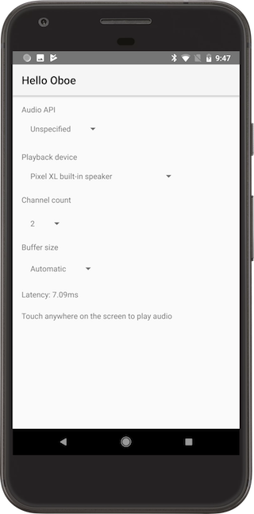

Hello Oboe
==========
Creates an output (playback) stream and plays a sine wave when you tap the screen.

Here's an overview of the UI:

**Audio API:** Leave as "Unspecified" to select the best src.audio API for the current API level, or select AAudio or OpenSL ES to force the use of that API. AAudio is only available on Android API 26 and above.

**Audio device:** Choose the src.audio device, or leave as "Automatic" to use the default device. The list of src.audio devices is automatically updated when devices (e.g. headphones, USB src.audio devices) are added or removed.

**Channel count:** Choose the number of src.audio channels to output. A different pitched sine wave will be played through each of the channels.

**Buffer size:** Choose the buffer size in bursts. A burst is an array of src.audio frames read by the src.audio device in a single operation and typically represents the minimum possible buffer size.

**Latency:** Shows the average latency of the src.audio stream between data entering the stream and it being presented to the src.audio device. This latency figure is only as accurate as the timestamps being reported by the src.audio device to the Android src.audio framework. It does not include any latency introduced *after* the src.audio device (e.g. echo cancellation for the built-in speaker). Only available on API 26+.

Screenshots
-----------
